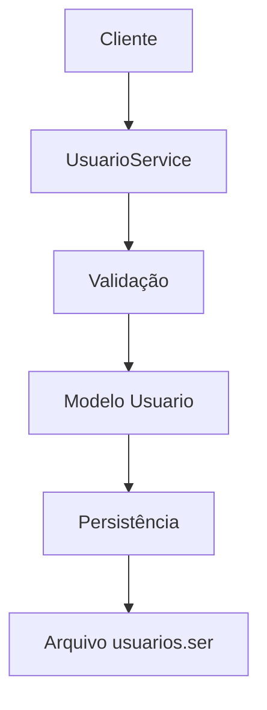

# Documentação Técnica - Criaturas Saltitantes

## Índice

1. [Visão Geral](#1-visão-geral)
2. [Guia Rápido de Execução](#2-guia-rápido-de-execução)
3. [Arquitetura do Sistema](#3-arquitetura-do-sistema)
4. [Modelos de Domínio](#4-modelos-de-domínio)
5. [Serviços](#5-serviços)
6. [Interface de Usuário](#6-interface-de-usuário)
7. [Persistência de Dados](#7-persistência-de-dados)
8. [Segurança](#8-segurança)
9. [Testes](#9-testes)
10. [API Reference](#10-api-reference)
11. [Configuração e Deploy](#11-configuração-e-deploy)

## 1. Visão Geral

### 1.1 Descrição do Sistema
O **Criaturas Saltitantes** é um sistema de simulação desenvolvido em Java que permite aos usuários:
- Gerenciar contas de usuário com autenticação segura
- Executar simulações de criaturas virtuais
- Visualizar estatísticas detalhadas de performance
- Competir em rankings baseados em sucessos

### 1.2 Objetivos
- **Qualidade de Software**: Implementar práticas de teste abrangentes (MC/DC, property-based, etc.)
- **Arquitetura Limpa**: Separação clara de responsabilidades
- **Segurança**: Sistema de autenticação robusto
- **Usabilidade**: Interface intuitiva e responsiva

### 1.3 Tecnologias Utilizadas
- **Java 17**: Linguagem base com recursos modernos
- **Maven**: Gerenciamento de dependências e build
- **Swing**: Interface gráfica nativa
- **JUnit 5**: Framework de testes
- **Mockito**: Mocking para testes isolados
- **jqwik**: Testes baseados em propriedades

## 2. Guia Rápido de Execução

### 2.1 🚀 Como Executar a Aplicação

#### Pré-requisitos
- Java 17+ instalado
- Maven 3.6+ instalado
- Git para clonar o repositório

#### Passos Rápidos
```bash
# 1. Clonar o repositório
git clone https://github.com/SarahTomaz/Criaturas-Saltitantes.git
cd Criaturas-Saltitantes

# 2. Compilar e gerar executável
mvn clean package

# 3. Executar aplicação
java -jar target/CriatV2-1.0-SNAPSHOT.jar
```

#### Execução Alternativa
```bash
# Via Maven (sem gerar JAR)
mvn exec:java -Dexec.mainClass="org.example.Main"
```

### 2.2 🧪 Como Executar os Testes

#### Executar Todos os Testes
```bash
# Suite completa de testes
mvn test

# Com relatório de cobertura
mvn test jacoco:report
```

#### Testes por Categoria
```bash
# Testes básicos e funcionais
mvn test -Dtest=TestUsuarioServiceSimple

# Cobertura MC/DC (100% estrutural)
mvn test -Dtest=TestUsuarioServiceMCDC

# Testes baseados em propriedades
mvn test -Dtest=TestUsuarioServiceProperties

# Testes de performance e concorrência
mvn test -Dtest=TestUsuarioServicePerformance
mvn test -Dtest=TestUsuarioServiceConcorrencia

# Testes com mocks e dublês
mvn test -Dtest=TestUsuarioServiceMocks

# Testes de exceções
mvn test -Dtest=TestUsuarioServiceExceptions

# Testes isolados
mvn test -Dtest=TestUsuarioServiceIsolated
```

#### Verificar Resultados
```bash
# Relatórios de teste em:
# target/surefire-reports/

# Relatório de cobertura em:
# target/site/jacoco/index.html
```

### 2.3 📊 Interpretando os Resultados

#### Relatórios de Teste
- **TEST-*.xml**: Relatórios detalhados em XML
- ***.txt**: Resumo dos testes em texto
- **index.html**: Relatório visual (se gerado)

#### Cobertura de Código
- **Linha**: Porcentagem de linhas executadas
- **Branch**: Porcentagem de branches (decisões) testadas
- **MC/DC**: Cobertura estrutural modificada condição/decisão

### 2.4 🔍 Debugging e Troubleshooting

#### Problemas Comuns
```bash
# Se testes falharem, execute individualmente:
mvn test -Dtest=TestUsuarioService#cadastrarUsuario_ComSucesso

# Para debug detalhado:
mvn test -X -Dtest=TestUsuarioService

# Para pular testes durante build:
mvn clean package -DskipTests
```

#### Logs e Saída
```bash
# Executar com logs detalhados
java -Ddebug=true -jar target/CriatV2-1.0-SNAPSHOT.jar

# Para testes com saída detalhada
mvn test -Dmaven.test.failure.ignore=true -Dtest.verbose=true
```

## 3. Arquitetura do Sistema

### 3.1 Padrão Arquitetural
O sistema segue uma arquitetura em camadas baseada no padrão MVC:

```
┌─────────────────────────────────────┐
│           Presentation Layer        │
│         (UI Components)             │
├─────────────────────────────────────┤
│           Service Layer             │
│        (Business Logic)             │
├─────────────────────────────────────┤
│           Model Layer               │
│        (Domain Objects)             │
├─────────────────────────────────────┤
│         Persistence Layer           │
│       (Data Serialization)         │
└─────────────────────────────────────┘
```

### 3.2 Componentes Principais

#### 3.2.1 Model Layer
- **Usuario**: Entidade principal com dados do usuário
- **Criatura**: Representação das criaturas do simulador
- **Simulacao**: Estado e configuração das simulações
- **Cluster**: Agrupamento de criaturas
- **GuardiaoHorizonte**: Controlador de limites da simulação

#### 3.2.2 Service Layer
- **UsuarioService**: Gerenciamento completo de usuários
- **SimuladorService**: Lógica das simulações
- **EstatisticasService**: Cálculo e geração de relatórios

#### 3.2.3 Presentation Layer
- **MainFrame**: Janela principal da aplicação
- **LoginDialog**: Tela de autenticação
- **SimulacaoPanel**: Interface das simulações
- **EstatisticasPanel**: Visualização de dados

## 4. Modelos de Domínio

### 4.1 Usuario
```java
public class Usuario implements Serializable {
    private String login;           // Identificador único
    private String senhaHash;       // Senha criptografada (SHA-256)
    private String avatar;          // Caminho da imagem do avatar
    private int pontuacao;          // Simulações bem-sucedidas
    private int totalSimulacoes;    // Total de simulações executadas
}
```

**Responsabilidades:**
- Armazenar dados do usuário
- Validar credenciais
- Calcular taxa de sucesso
- Manter histórico de simulações

**Invariantes:**
- `login` nunca pode ser null ou vazio
- `pontuacao` ≤ `totalSimulacoes`
- `senhaHash` sempre em formato SHA-256

### 4.2 Criatura
```java
public class Criatura {
    private int x, y;               // Posição atual
    private int velocidadeX, velocidadeY; // Velocidade de movimento
    private Color cor;              // Cor da criatura
    private int tamanho;            // Tamanho da criatura
}
```

**Responsabilidades:**
- Controlar movimento e posição
- Detectar colisões
- Renderizar na interface

### 4.3 Simulacao
```java
public class Simulacao {
    private List<Criatura> criaturas;
    private int largura, altura;
    private boolean ativa;
    private long tempoInicio;
}
```

**Responsabilidades:**
- Gerenciar estado da simulação
- Controlar ciclo de vida das criaturas
- Medir tempo de execução

## 5. Serviços

### 5.1 UsuarioService

#### 5.1.1 Funcionalidades Principais
```java
public class UsuarioService {
    // Operações CRUD
    public boolean cadastrarUsuario(String login, String senha, String avatar);
    public Usuario autenticar(String login, String senha);
    public boolean removerUsuario(String login);
    public boolean alterarAvatar(String login, String novoAvatar);
    
    // Gestão de sessão
    public void logout();
    public Usuario getUsuarioLogado();
    public boolean temUsuarioLogado();
    
    // Operações de dados
    public List<Usuario> listarUsuarios();
    public int getTotalUsuarios();
    public boolean atualizarPontuacao(String login, int resultado);
}
```

#### 5.1.2 Regras de Negócio
- **Senha**: Mínimo 4 caracteres, hash SHA-256
- **Login**: Único no sistema, case-insensitive
- **Avatar**: Valor padrão "default.png" se null/vazio
- **Persistência**: Salvamento automático após operações

#### 5.1.3 Fluxos de Dados


### 5.2 EstatisticasService

#### 5.2.1 Métricas Disponíveis
```java
public class EstatisticasService {
    // Estatísticas globais
    public int getTotalUsuarios();
    public int getTotalSimulacoesGlobal();
    public double getTaxaSucessoGlobal();
    
    // Médias e rankings
    public double getMediaSimulacoesPorUsuario();
    public List<Usuario> getRankingUsuarios();
    
    // Relatórios
    public String gerarRelatorioCompleto();
    public String getEstatisticasUsuario(String login);
}
```

#### 5.2.2 Cálculos Implementados
- **Taxa de Sucesso**: `pontuacao / totalSimulacoes`
- **Média por Usuário**: `totalGlobal / quantidadeUsuarios`
- **Ranking**: Ordenação por pontuação decrescente

### 5.3 SimuladorService

#### 5.3.1 Funcionalidades
```java
public class SimuladorService {
    public Simulacao criarSimulacao(int largura, int altura);
    public void adicionarCriatura(Simulacao sim, Criatura criatura);
    public void executarPassos(Simulacao sim, int passos);
    public boolean verificarColisoes(Simulacao sim);
}
```

## 6. Interface de Usuário

### 6.1 Estrutura da GUI
```
MainFrame
├── MenuBar
│   ├── Arquivo
│   ├── Simulação
│   └── Estatísticas
├── ToolBar
├── ContentPanel
│   ├── SimulacaoPanel
│   └── EstatisticasPanel
└── StatusBar
```

### 6.2 Componentes Principais

#### 6.2.1 LoginDialog
- **Propósito**: Autenticação inicial
- **Campos**: Login, Senha, Opção de cadastro
- **Validação**: Cliente e servidor

#### 6.2.2 SimulacaoPanel
- **Propósito**: Visualização das simulações
- **Componentes**: Canvas, controles, informações
- **Atualização**: Timer-based rendering

#### 6.2.3 EstatisticasPanel
- **Propósito**: Exibição de relatórios
- **Componentes**: Tabelas, gráficos, rankings
- **Refresh**: Automático após simulações

## 7. Persistência de Dados

### 7.1 Estratégia de Persistência
- **Formato**: Serialização Java nativa
- **Arquivo**: `data/usuarios.ser`
- **Backup**: Criação automática de diretórios
- **Recovery**: Tratamento de arquivos corrompidos

### 7.2 Estrutura de Dados
```java
// Arquivo serializado contém:
List<Usuario> usuarios = new ArrayList<>();
```

### 7.3 Operações de Arquivo
```java
// Carregamento
private void carregarUsuarios() {
    try (ObjectInputStream ois = new ObjectInputStream(
         new FileInputStream(ARQUIVO_USUARIOS))) {
        usuarios = (List<Usuario>) ois.readObject();
    } catch (Exception e) {
        usuarios = new ArrayList<>(); // Fallback
    }
}

// Salvamento
private void salvarUsuarios() {
    File arquivo = new File(ARQUIVO_USUARIOS);
    arquivo.getParentFile().mkdirs(); // Criar diretórios
    
    try (ObjectOutputStream oos = new ObjectOutputStream(
         new FileOutputStream(arquivo))) {
        oos.writeObject(usuarios);
    }
}
```

## 8. Segurança

### 8.1 Autenticação
- **Algoritmo**: SHA-256 para hash de senhas
- **Salt**: Não implementado (consideração futura)
- **Sessão**: Usuário logado em memória

### 8.2 Implementação do Hash
```java
private String hashSenha(String senha) {
    try {
        MessageDigest md = MessageDigest.getInstance("SHA-256");
        byte[] hash = md.digest(senha.getBytes());
        StringBuilder hexString = new StringBuilder();
        for (byte b : hash) {
            String hex = Integer.toHexString(0xff & b);
            if (hex.length() == 1) hexString.append('0');
            hexString.append(hex);
        }
        return hexString.toString();
    } catch (NoSuchAlgorithmException e) {
        throw new RuntimeException("Erro ao gerar hash da senha", e);
    }
}
```

### 8.3 Validações
- **Login**: Não vazio, único no sistema
- **Senha**: Mínimo 4 caracteres
- **Entrada**: Sanitização básica de dados

## 9. Testes

### 9.1 Estratégia de Testes
O projeto implementa uma abordagem de testes abrangente com múltiplas técnicas:

#### 9.1.1 Tipos de Teste Implementados
1. **Testes Unitários**: Cobertura básica de funcionalidades
2. **Testes MC/DC**: Cobertura estrutural completa (100%)
3. **Testes de Propriedades**: Verificação de invariantes
4. **Testes de Concorrência**: Thread-safety
5. **Testes de Performance**: Análise de desempenho
6. **Testes de Exceções**: Tratamento de erros
7. **Testes de Integração**: Interação entre componentes

#### 9.1.2 Estrutura dos Testes
```
test/java/service/
├── TestUsuarioService.java           # Suite principal
├── TestUsuarioServiceMCDC.java       # Cobertura MC/DC
├── TestUsuarioServiceProperties.java # Property-based
├── TestUsuarioServiceConcorrencia.java # Thread-safety
├── TestUsuarioServicePerformance.java # Performance
├── TestUsuarioServiceMocks.java      # Dublês de teste
├── TestUsuarioServiceIsolated.java   # Testes isolados
├── TestUsuarioServiceExceptions.java # Exceções
└── TestUsuarioServiceSimple.java     # Testes básicos
```

### 9.2 Cobertura MC/DC
Modified Condition/Decision Coverage implementada para garantir que:
- Cada condição em decisões complexas seja testada
- Todas as combinações de condições sejam cobertas
- 100% de cobertura estrutural seja alcançada

Exemplo:
```java
@Test
@DisplayName("MC/DC: Login null OU senha null deve retornar null")
void autenticar_LoginOuSenhaNulos_MCDC() {
    // Testa: login == null || senha == null
    
    // Caso 1: login null, senha não null (primeira condição true)
    assertNull(usuarioService.autenticar(null, "senha"));
    
    // Caso 2: login não null, senha null (segunda condição true)
    assertNull(usuarioService.autenticar("login", null));
    
    // Caso 3: ambos null (ambas condições true)
    assertNull(usuarioService.autenticar(null, null));
    
    // Caso 4: nenhum null (ambas condições false)
    // Requer usuário cadastrado para teste completo
}
```

### 9.3 Testes de Propriedades
Usando jqwik para verificar propriedades que devem sempre ser verdadeiras:

```java
@Property
void propriedade_CadastroSempreAumentaOuMantemTotal(
    @ForAll String login, 
    @ForAll String senha, 
    @ForAll String avatar) {
    
    Assume.that(login != null && !login.trim().isEmpty());
    Assume.that(senha != null && senha.length() >= 4);
    
    int totalAntes = usuarioService.getTotalUsuarios();
    usuarioService.cadastrarUsuario(login, senha, avatar);
    int totalDepois = usuarioService.getTotalUsuarios();
    
    assertThat(totalDepois).isGreaterThanOrEqualTo(totalAntes);
}
```

### 9.4 Testes de Performance
```java
@Test
@DisplayName("Performance: Sistema deve suportar 1000 usuários")
void performance_MuitosUsuarios() {
    long inicio = System.currentTimeMillis();
    
    for (int i = 0; i < 1000; i++) {
        usuarioService.cadastrarUsuario("user" + i, "senha" + i, "avatar.png");
    }
    
    long fim = System.currentTimeMillis();
    long duracao = fim - inicio;
    
    // Verificações de performance
    assertThat(duracao).isLessThan(5000); // Menos de 5 segundos
    assertThat(usuarioService.getTotalUsuarios()).isEqualTo(1000);
    
    // Teste de busca em massa
    Usuario usuario = usuarioService.autenticar("user500", "senha500");
    assertThat(usuario).isNotNull();
}
```

## 10. API Reference

### 10.1 UsuarioService API

#### 10.1.1 Cadastro de Usuário
```java
/**
 * Cadastra um novo usuário no sistema
 * @param login Login único do usuário (obrigatório, não vazio)
 * @param senha Senha do usuário (mínimo 4 caracteres)
 * @param avatar Caminho do avatar (opcional, padrão: "default.png")
 * @return true se cadastrado com sucesso, false se login já existe
 * @throws IllegalArgumentException se login vazio ou senha inválida
 */
public boolean cadastrarUsuario(String login, String senha, String avatar)
```

#### 10.1.2 Autenticação
```java
/**
 * Autentica um usuário e define como logado
 * @param login Login do usuário
 * @param senha Senha em texto plano
 * @return Usuario autenticado ou null se credenciais inválidas
 */
public Usuario autenticar(String login, String senha)
```

#### 10.1.3 Gerenciamento de Dados
```java
/**
 * Lista todos os usuários cadastrados
 * @return Cópia da lista de usuários (modificações não afetam original)
 */
public List<Usuario> listarUsuarios()

/**
 * Atualiza a pontuação de um usuário após simulação
 * @param login Login do usuário
 * @param resultado 1 para sucesso, 0 para falha
 * @return true se atualizado com sucesso
 */
public boolean atualizarPontuacao(String login, int resultado)
```

### 10.2 EstatisticasService API

#### 10.2.1 Relatórios
```java
/**
 * Gera relatório completo com todas as estatísticas
 * @return String formatada com estatísticas completas
 */
public String gerarRelatorioCompleto()

/**
 * Gera estatísticas específicas de um usuário
 * @param login Login do usuário
 * @return String com estatísticas do usuário ou "Usuário não encontrado"
 */
public String getEstatisticasUsuario(String login)
```

#### 10.2.2 Métricas
```java
/**
 * Calcula taxa de sucesso global do sistema
 * @return Valor entre 0.0 e 1.0 representando a taxa
 */
public double getTaxaSucessoGlobal()

/**
 * Obtém ranking de usuários ordenado por pontuação
 * @return Lista ordenada (maior pontuação primeiro)
 */
public List<Usuario> getRankingUsuarios()
```

## 11. Configuração e Deploy

### 11.1 Requisitos do Sistema
- **Java**: Versão 17 ou superior
- **Memória**: Mínimo 256MB RAM
- **Disco**: 50MB de espaço livre
- **Sistema**: Windows, Linux, macOS

### 10.2 Build e Execução

#### 10.2.1 Compilação e Build
```bash
# Limpar projeto e compilar
mvn clean compile

# Gerar JAR executável
mvn clean package

# Compilar apenas (sem executar testes)
mvn compile -DskipTests
```

#### 10.2.2 Executando a Aplicação

**Opção 1 - Via JAR (Recomendado):**
```bash
# Gerar JAR primeiro
mvn clean package

# Executar aplicação principal
java -jar target/CriatV2-1.0-SNAPSHOT.jar
```

**Opção 2 - Via Maven:**
```bash
# Executar classe Main diretamente
mvn exec:java -Dexec.mainClass="org.example.Main"

# Ou com argumentos específicos
mvn exec:java -Dexec.mainClass="org.example.Main" -Dexec.args="arg1 arg2"
```

**Opção 3 - Via IDE:**
- Abra o projeto em sua IDE (IntelliJ IDEA, Eclipse, VS Code)
- Navegue até `src/main/java/org/example/Main.java`
- Execute a classe Main diretamente

#### 10.2.3 Executando Testes

**Todos os Testes:**
```bash
# Executar toda a suite de testes
mvn test

# Executar testes com relatório detalhado
mvn test -Dmaven.test.failure.ignore=true

# Executar testes e gerar relatório de cobertura
mvn test jacoco:report
```

**Testes Específicos:**
```bash
# Executar classe de teste específica
mvn test -Dtest=TestUsuarioService

# Executar método específico
mvn test -Dtest=TestUsuarioService#cadastrarUsuario_ComSucesso

# Executar múltiplas classes
mvn test -Dtest=TestUsuarioService,TestEstatisticaService

# Executar testes por padrão
mvn test -Dtest="*MCDC*"
```

**Testes por Categoria:**
```bash
# Testes unitários básicos
mvn test -Dtest=TestUsuarioServiceSimple

# Testes de cobertura MC/DC
mvn test -Dtest=TestUsuarioServiceMCDC

# Testes baseados em propriedades
mvn test -Dtest=TestUsuarioServiceProperties

# Testes de performance
mvn test -Dtest=TestUsuarioServicePerformance

# Testes de concorrência
mvn test -Dtest=TestUsuarioServiceConcorrencia
```

#### 10.2.4 Verificação de Qualidade
```bash
# Executar todos os testes com cobertura
mvn clean test jacoco:report

# Verificar resultados dos testes
# Os relatórios ficam em: target/surefire-reports/

# Verificar cobertura de código
# O relatório fica em: target/site/jacoco/index.html
```

### 11.3 Configurações
#### 11.3.1 Arquivo de Dados
- **Localização**: `data/usuarios.ser`
- **Criação**: Automática no primeiro uso
- **Backup**: Recomendado backup manual

#### 11.3.2 Configurações de JVM
```bash
# Para melhor performance
java -Xmx512m -Xms256m -jar CriatV2-1.0-SNAPSHOT.jar

# Para debugging
java -Ddebug=true -jar CriatV2-1.0-SNAPSHOT.jar
```

### 11.4 Troubleshooting

#### 11.4.1 Problemas Comuns
1. **Erro de permissão**: Verificar permissões de escrita na pasta `data/`
2. **Arquivo corrompido**: Deletar `usuarios.ser` para reset
3. **Erro de versão Java**: Verificar versão com `java -version`

#### 10.4.2 Logs e Debug
- Logs são exibidos no console
- Para debug detalhado: adicionar `-Ddebug=true`
- Arquivo de log: `logs/application.log` (se configurado)

---